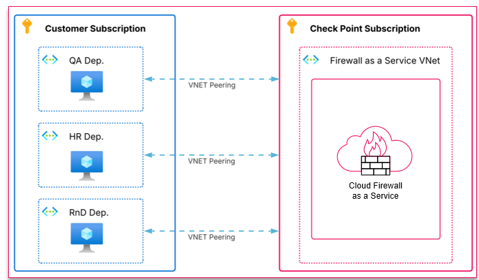

# Azure Check Point Cloud Firewall as a Service Lab

This environment deploys a 100% Terraform-based Azure lab for testing Check Point Cloud Firewall as a Service inspection patterns:

- 3 client NETs (QA Dep, HR Dep and RnD Dep)
- 3 EC2 instances:
  - Linux bastion (public IP) in QA Dep VNET public subnet.
  - Linux1 (private IP) in QA Dep VNET and subnet.
  - Linux2 (private IP) in HR Dep VNET and subnet.
  - Linux3 (private IP) in RnD Dep VNET and subnet.

  ## Architecture Diagram



To edit this diagram, open [drawings/lab-azure-chkp-cfaas.drawio.png](./drawings/lab-azure-chkp-cfaas.drawio.png) with [diagrams.net](https://app.diagrams.net/) (File -> Open From -> GitHub).

## Environment Setup

### Remote State (Optional)

- Create the storage account & container: Follow Microsoft's guide for creating the Azure Storage account and blob container (Azure Portal, Azure CLI, or ARM): https://learn.microsoft.com/en-us/azure/developer/terraform/store-state-in-azure-storage

- Get the storage access key and store it as an environment variable (Powershell):

```
az login --service-principal --username $ARM_CLIENT_ID --password $ARM_CLIENT_SECRET --tenant $ARM_TENANT_ID
```

```bash
RESOURCE_GROUP_NAME=tfstate
STORAGE_ACCOUNT_NAME=tfstate$RANDOM
CONTAINER_NAME=tfstate

az group create --name $RESOURCE_GROUP_NAME --location eastus
az storage account create --resource-group $RESOURCE_GROUP_NAME --name $STORAGE_ACCOUNT_NAME --sku Standard_LRS --encryption-services blob
az storage container create --name $CONTAINER_NAME --account-name $STORAGE_ACCOUNT_NAME

ACCOUNT_KEY=$(az storage account keys list --resource-group $RESOURCE_GROUP_NAME --account-name $STORAGE_ACCOUNT_NAME --query '[0].value' -o tsv)
export ARM_ACCESS_KEY=$ACCOUNT_KEY
```

- **Initialize Terraform and migrate local state (example):**

```bash
terraform init \
  -backend-config="resource_group_name=$RESOURCE_GROUP_NAME" \
  -backend-config="storage_account_name=$STORAGE_ACCOUNT_NAME" \
  -backend-config="container_name=$CONTAINER_NAME" \
  -backend-config="key=terraform.tfstate"
```

## Quick Start

### Deployment Instructions

1. Copy and edit tfvars:

```bash
cp terraform.tfvars.example terraform.tfvars
```

2. Paste your public key into `keys/lab-key.pub` (or change `public_key_path`).

3. Update values in `terraform.tfvars` where needed

4. Initialize and validate:

```bash
terraform init
terraform validate
```

5. Deploy:

```bash
terraform plan -out=tfplan
terraform apply tfplan
```