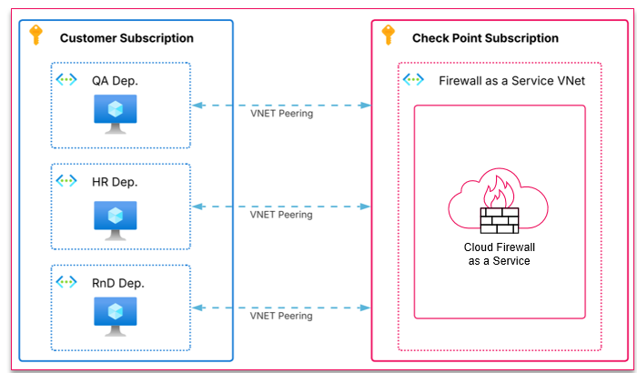

# Azure Check Point Cloud Firewall as a Service Lab

This environment deploys a Terraform-based Azure lab for testing Check Point Cloud Firewall as a Service inspection patterns:

- 3 client NETs (QA Dep, HR Dep and RnD Dep)
- 3 EC2 instances:
  - Linux bastion (public IP) in QA Dep VNET public subnet.
  - Linux1 (private IP) in QA Dep VNET and subnet.
  - Linux2 (private IP) in HR Dep VNET and subnet.
  - Linux3 (private IP) in RnD Dep VNET and subnet.

  ## Architecture Diagram



To edit this diagram, open [drawings/lab-azure-chkp-cfaas.drawio.png](./drawings/lab-azure-chkp-cfaas.drawio.png) with [diagrams.net](https://app.diagrams.net/) (File -> Open From -> GitHub).

## IAM For Check Point VNet Peering

This repository creates a custom Azure role and assigns it to the Check Point service principal for each subscription listed in `assignable_scopes`.

Important:

- The custom role permissions are defined in Terraform code (`iam.tf`).
- `AssignableScopes` limits where the role can be used. It does not grant access on its own.
- Access is granted by role assignments created per scope for the provided Check Point SP object ID.

### Role Permissions Applied By Terraform

The role allows only VNet peering operations:

- `Microsoft.Network/virtualNetworks/virtualNetworkPeerings/read`
- `Microsoft.Network/virtualNetworks/virtualNetworkPeerings/write`
- `Microsoft.Network/virtualNetworks/virtualNetworkPeerings/delete`
- `Microsoft.Network/virtualNetworks/peer/action`

## Environment Setup

### Remote State (Optional)

- Create the storage account & container: Follow Microsoft's guide for creating the Azure Storage account and blob container (Azure Portal, Azure CLI, or ARM): https://learn.microsoft.com/en-us/azure/developer/terraform/store-state-in-azure-storage

- Get the storage access key and store it as an environment variable (Powershell):

```
az login --service-principal --username $ARM_CLIENT_ID --password $ARM_CLIENT_SECRET --tenant $ARM_TENANT_ID
```

```bash
RESOURCE_GROUP_NAME=tfstate
STORAGE_ACCOUNT_NAME=tfstate$RANDOM
CONTAINER_NAME=tfstate

az group create --name $RESOURCE_GROUP_NAME --location eastus
az storage account create --resource-group $RESOURCE_GROUP_NAME --name $STORAGE_ACCOUNT_NAME --sku Standard_LRS --encryption-services blob
az storage container create --name $CONTAINER_NAME --account-name $STORAGE_ACCOUNT_NAME

ACCOUNT_KEY=$(az storage account keys list --resource-group $RESOURCE_GROUP_NAME --account-name $STORAGE_ACCOUNT_NAME --query '[0].value' -o tsv)
export ARM_ACCESS_KEY=$ACCOUNT_KEY
```

- **Initialize Terraform and migrate local state (example):**

```bash
terraform init \
  -backend-config="resource_group_name=$RESOURCE_GROUP_NAME" \
  -backend-config="storage_account_name=$STORAGE_ACCOUNT_NAME" \
  -backend-config="container_name=$CONTAINER_NAME" \
  -backend-config="key=terraform.tfstate"
```

**Tagging tfstate storage account**

- **Purpose:** Tag the Azure Storage Account that holds Terraform state with Git metadata so the state can be traced back to the repository, branch and commit that created or last touched it.
- **Script:** [scripts/tag-tfstate-storage.sh](scripts/tag-tfstate-storage.sh) — updates tags `git_repo`, `git_branch`, `git_commit`, and `git_commit_date` on the storage account.
- **How to run:** Source [.env](.env) (or set the required env vars) then run:

```
bash scripts/tag-tfstate-storage.sh
```
- **Requirements:** `az` CLI and Azure credentials (`ARM_CLIENT_ID`, `ARM_CLIENT_SECRET`, `ARM_TENANT_ID`) available in the environment or in `.env`.
- **Terraform alternative:** To manage tags declaratively, import the storage account into Terraform and add an `azurerm_storage_account` resource (see `storage_state.tf`).
- **Use cases:** Run the script manually after creating the storage account, include it in CI to label state storage automatically, or use it for auditing and discovery of which repo/commit owns the state.

## Quick Start

### Deployment Instructions

1. Copy and edit tfvars:

```bash
cp terraform.tfvars.example terraform.tfvars
```

2. Provide an existing Check Point service principal object ID in `terraform.tfvars` as `checkpoint_sp_object_id`.

  If you do not have a service principal, ask your tenant administrator to create one or to grant your account permissions to register applications. This repository no longer creates Azure AD applications.

3. Set the `checkpoint_sp_object_id` value in `terraform.tfvars`.

4. Update values in `terraform.tfvars` where needed

5. Copy, edit and set env variables:

```bash
cp .env.example .env
```

6. Paste your public key into `keys/lab-key.pub` (or change `public_key_path`).

7. Initialize and validate:

```bash
terraform init
terraform validate
```

8. Deploy:

```bash
terraform plan -out=tfplan
terraform apply tfplan
```